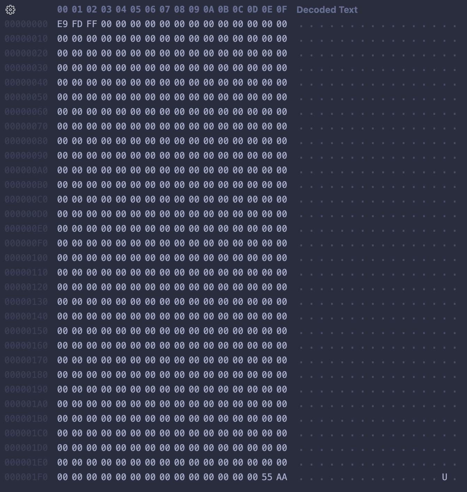
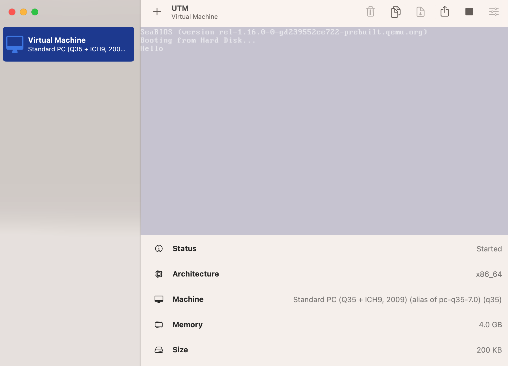
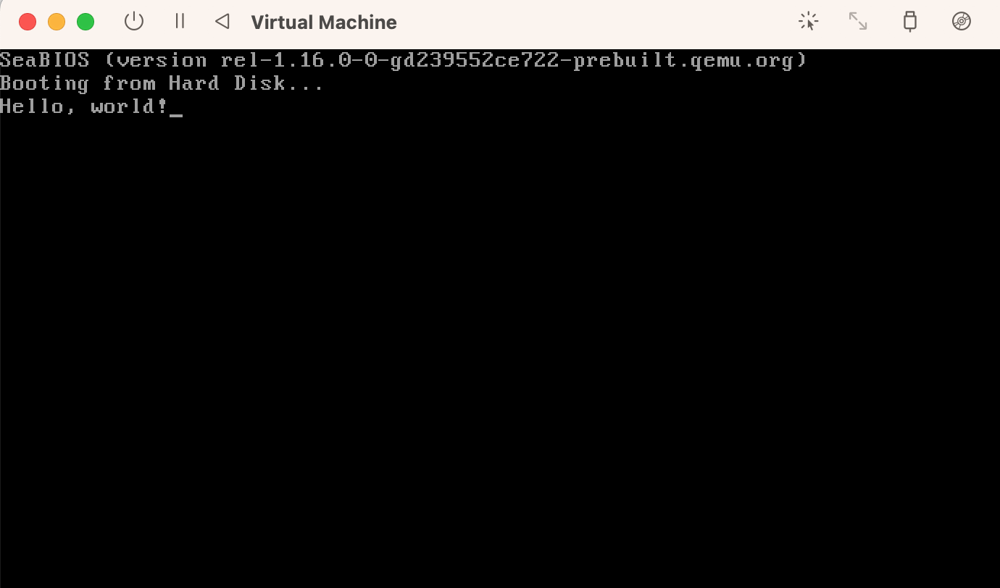

# little-os

Trying some kernel development :)

Using the following as a tutorial:
- https://github.com/cfenollosa/os-tutorial/tree/master/01-bootsector-barebones
- https://www.cs.bham.ac.uk/~exr/lectures/opsys/10_11/lectures/os-dev.pdf

# Notes

## The Boot Sector

### Background

#### The Boot Process

- pre-OS environment has barely anything -- it doesn't even have a file system.
- Basic Input/Output System (BIOS): set of service routines that are provided through a ROM chip on the motherboard of a computer
  - Completes hardware scans of important components (like the RAM)
  - Can only read certain sectors of disk -> cannot read OS image like a file b/c no file system (so "files" do not exist). Reads specific cylinder #, head #, sector # for a certain amount of data (ex: 512 bytes).
- Boot Sector: the first sector of a disk (cylinder 0, head 0, sector 0), 512 bytes long (known as the Master Boot Record (MBR) on PCs)
  - Contains 2 things:
    - Partition information of the disk
    - The boot loader
  - Boot loader: software that actually starts the boot process and loads the OS program into memory + starts running it

#### Boot Sectors

Boot Sector: the portion of a disk which contains machine code to be loaded into RAM and executed by BIOS.
- Basic Input/Output System (BIOS): ROM chip that provides a basic interface to the computer

#### 16-bit Real Mode

- All x86 CPUs require a 16-bit mode (even if the processor may support 32-bit or 64-bit addressing) to ensure backwards compatibility (i.e. that modern CPU instruction sets are compatible with older CPUs)
  - So, OSes start out on 16-bit real mode and then boot up into the full 32-bit or 64-bit modes that they were made for. Older OSes simply continue to run in 16-bit real mode on the CPU (unaware that it is capable of more)
- BIOS programs (such as the boot sector) run in 16-bit real mode. Then, when the kernel takes over and runs the OS, it will move up to use 32-bit or 64-bit protected mode.
- More about this topic here: https://wiki.osdev.org/Real_Mode

### Implementation

#### The most basic boot sector:

- This is the most barebones boot sector you can get. It's 512 bytes, and the last 2 bytes are what determines if the disc is bootable. The last 2 bytes of the boot sector must be xAA55 (it's reverse in the picture above because of endianess). You can actually view the binary content of files in VS Code (which is what this snippet is) through VS Code's Hex Editor extension -- it's pretty cool.
- The file is in `boot-sector.bin` and can be run with QEMU using `qemu boot-sector.bin`.
- I found an issue running the above `qemu` command with an M1 Mac, and I quickly realized it was because QEMU only natively supports ARM architectures. So, the machine would boot, but it wouldn't be able to run the assembly (because it was x86 assembly, of course).
  - I had an idea -- QEMU may not natively support x86 emulators, but UTM does. So, I set up a virtual machine on UTM that runs a standard x86 architecture. Within UTM, I could strip all of the default arguments genereated for QEMU by UTM and add `boot-sector.bin` as a parameter. And there we have it: a running boot sector :)

    
    
      = the coolest hello world program I've ever written

  - Just a note, for this one instead of directly editing the hex value in `boot-sector.bin`, I used assembly code found in the toturials and generated `boot-sector.bin` with NASM. Inspecting it with the Hex editor, it changed a bit, but the magic number stayed at the end of the file.
  - But anyway, this is awesome -- a running boot sector. Kinda glad I took CS 2200 to help with debugging...

## Adding functionality to the boot sector

- Goal: write a boot program that's a bit more advanced than the "Hello, world!" program shown above
